# NEXT JS NOTES

## chapter 1: Getting started

- `npx create-next-app@latest [project-name] [options]` this is how we set up a new Next.js project
- Placeholder data: [placeholder-data.ts](./app/lib/placeholder-data.ts) will be used to simulate data fetching from an API or database
- [definitions.ts](./app/lib/definitions.ts) : this file contains type definitions for your data
- instead of writing `customers: { id: string; name: string; ... }[]` this everytime, with definitions.ts, we can just write `customers: User[]`
```typescript
// This file contains type definitions for your data.
// It describes the shape of the data, and what data type each property should accept.
// For simplicity of teaching, we're manually defining these types.
// However, these types are generated automatically if you're using an ORM such as Prisma.
export type User = {
    id: string;
    name: string;
    email: string;
    password: string;
};
```

## chapter 2: CSS styling

- [global.css](./app/styles/global.css) : this file contains global styles that apply to the entire application
- use this file to add CSS rules to all the routes in your application - such as CSS reset rules, site-wide styles for HTML elements like links, and more
- You can import global.css in any component in your application, but it's usually good practice to add it to your top-level component. In Next.js, this is the root layout [layout.tsx](./app/layout.tsx).
```typescript
// This is the root layout component for the Next.js application.
// It wraps all the pages and components in the application.
// Here, we import global CSS styles to apply them across the entire app.
import '@/app/styles/global.css';

export default function RootLayout({
   children,
}: {
    children: React.ReactNode;
}) {
    return (
        <html lang="en">
            <body>{children}</body>
        </html>
    );
}
```
before importing global css: 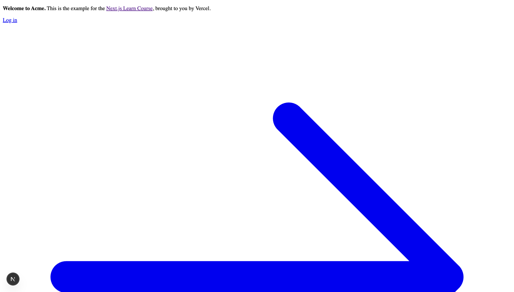
after importing global css: 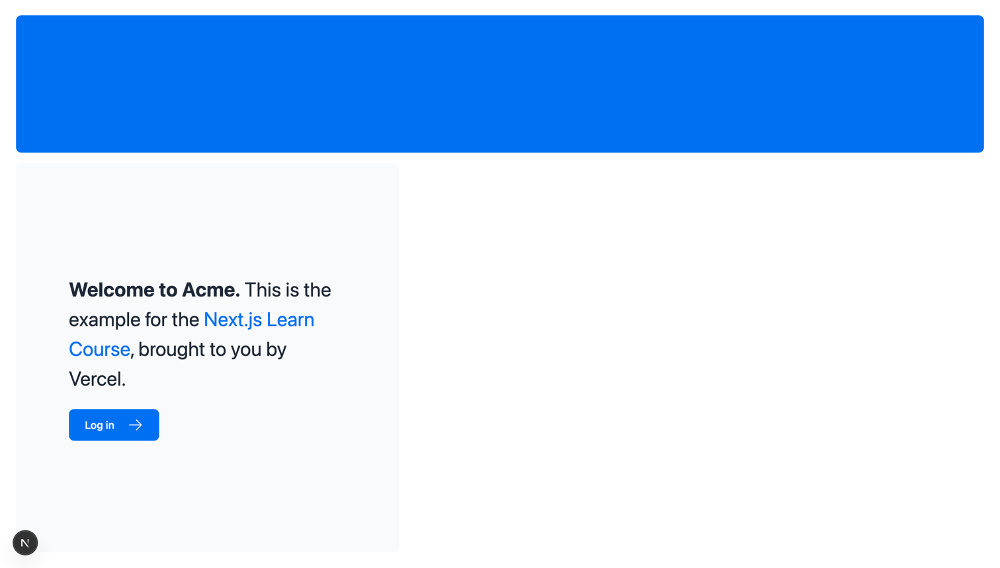
- notice the tailwind directives inside global.css, which import Tailwind's base styles, components, and utilities. 
- Tailwind is a CSS framework that speeds up the development process by allowing you to quickly write utility classes directly in your React code.
```css
@tailwind base;
@tailwind components;
@tailwind utilities;
```
- example usage of tailwind classes in [page.tsx](./app/page.tsx)
- we don't have to use tailwind css we can use css modules
```css
/*
example of using css module instead of tailwindcss (an alternative)
*/
.shape {
    height: 0;
    width: 0;
    border-bottom: 30px solid black;
    border-left: 20px solid transparent;
    border-right: 20px solid transparent;
}
```
- use clsx library to conditionally apply multiple classes to an element refer [status.tsx](app/ui/invoices/status.tsx)
```typescript
import clsx from 'clsx';
 
export default function InvoiceStatus({ status }: { status: string }) {
  return (
    <span
      className={clsx(
        'inline-flex items-center rounded-full px-2 py-1 text-sm',
        {
          'bg-gray-100 text-gray-500': status === 'pending',
          'bg-green-500 text-white': status === 'paid',
        },
      )}
    >
    // ...
)}
```

## chapter 3: Optimizing fonts and images

- why we need to optimze fonts and images?
  - performance: optimized fonts and images load faster, improving page load times and overall user experience.
  - SEO: search engines favor websites that load quickly, which can positively impact search rankings.
  - user experience: optimized assets lead to a smoother and more enjoyable browsing experience for users.
  - Cumulative Layout Shift is a metric used by Google to evaluate the performance and user experience of a website. With fonts, layout shift happens when the browser initially renders text in a fallback or system font and then swaps it out for a custom font once it has loaded. This swap can cause the text size, spacing, or layout to change, shifting elements around it.
  - when a user visits your application, there are no additional network requests for fonts which would impact performance.
  - Next.js downloads font files at build time and hosts them with your other static assets. This means when a user visits your application, there are no additional network requests for fonts which would impact performance.
  - Next.js can serve static assets, like images, under the top-level /public folder. Files inside /public can be referenced in your application.
  - you can use the next/image component to automatically optimize your images.
  - mobile version: 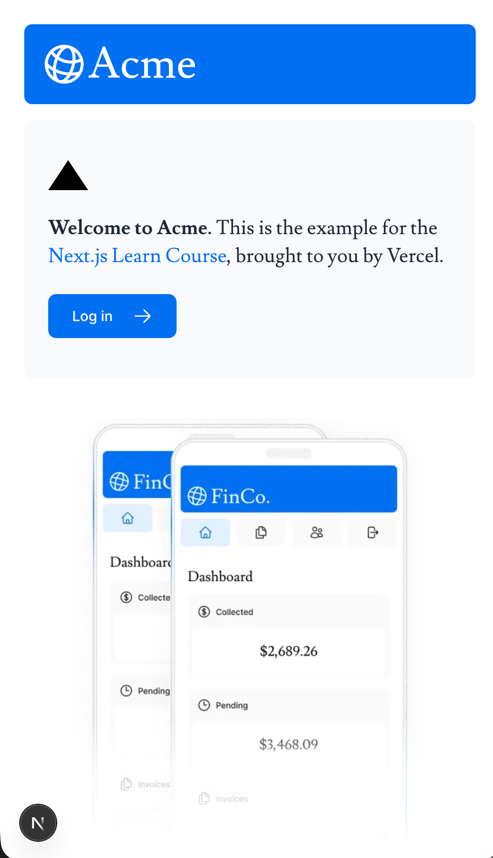
  - desktop version: 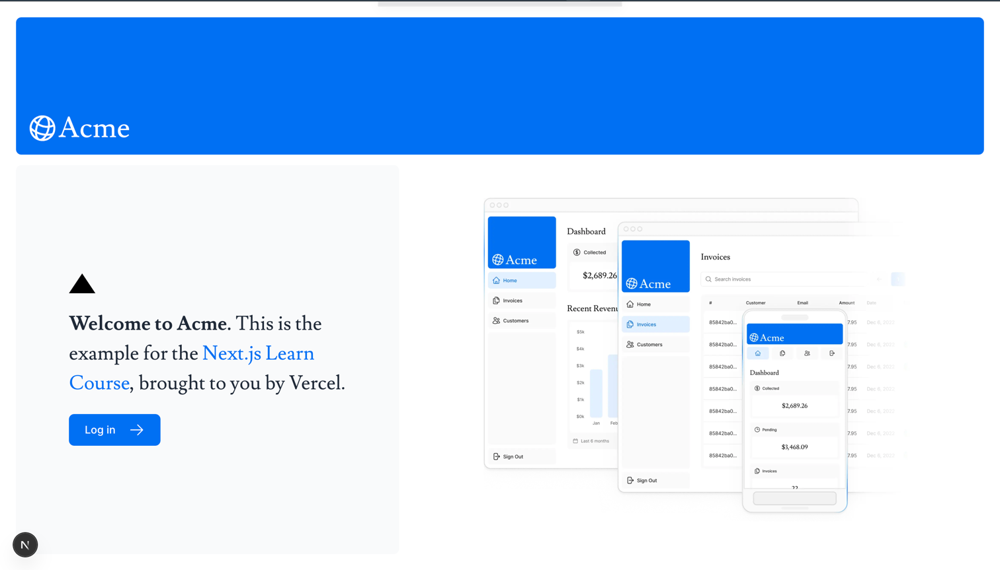
  - also the width and height attributes help prevent Cumulative Layout Shift by reserving the appropriate amount of space for the image before it loads.
  - these width and height are not exact display sizes but rather the intrinsic dimensions of the image. The actual display size can be controlled using CSS or other layout techniques.
```typescript jsx
<div className="flex items-center justify-center p-6 md:w-3/5 md:px-28 md:py-12">
    {/* Add Hero Images Here */}
    <Image
        src={"/hero-desktop.png"}
        alt={"Screenshots of the dashboard project showing desktop version"}
        width={1000}
        height={760}
        className={"hidden md:block"}
    />
    <Image
        src={'/hero-mobile.png'}
        alt={"Screenshots of the dashboard project showing mobile version"}
        width={500}
        height={620}
        className={"block md:hidden"}
    />
</div>
```

## Chapter 4: Creating layouts and Pages. 
- In Next.js, layouts are special components that define the structure and appearance of your pages. They allow you to create a consistent look and feel across multiple pages in your application.
- Layouts are typically used to wrap around your page components, providing common elements like headers, footers, navigation menus, and sidebars.
- In Next.js, you can create a layout by creating a file named layout.tsx in the directory where you want to apply the layout.
- For example, if you want to create a layout for all pages under the /dashboard directory, you would create a file at /dashboard/layout.tsx.
- Here's an example of a simple layout component: 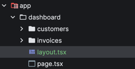
```typescript jsx
import SideNav from '@/app/ui/dashboard/sidenav';
 
export default function Layout({ children }: { children: React.ReactNode }) {
  return (
    <div className="flex h-screen flex-col md:flex-row md:overflow-hidden">
      <div className="w-full flex-none md:w-64">
        <SideNav />
      </div>
      <div className="grow p-6 md:overflow-y-auto md:p-12">{children}</div>
    </div>
  );
}
```
- In this example, the Layout component includes a SideNav component and a main content area where the children prop is rendered. The children prop represents the content of the specific page that uses this layout.
- To use this layout for a specific page, you would create a page component in the same directory, for example, /dashboard/page.tsx:
- A root layout is a special type of layout that applies to the entire application. In Next.js, you can create a root layout by creating a file named layout.tsx in the root of the /app directory. It is required in every Next.js application using the App Router.
  - ours is located at [layout.tsx](./app/layout.tsx)
- example of different pages inside app/dashboard: 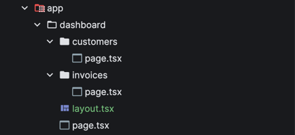
  - now we have access to these links: http://localhost:3000/dashboard, http://localhost:3000/dashboard/invoices, http://localhost:3000/dashboard/customers

## Chapter 5: Navigation and linking between pages
- In Next.js, you can use the <Link /> Component to link between pages in your application. <Link> allows you to do client-side navigation with JavaScript.
- before this we are using <a> tag for navigation which causes a full page reload. With <Link>, Next.js intercepts the click event and performs a client-side navigation, which is faster and smoother.
```typescript jsx
<Link
    key={link.name}
    href={link.href}
    className="flex h-[48px] grow items-center justify-center gap-2 rounded-md bg-gray-50 p-3 text-sm font-medium hover:bg-sky-100 hover:text-blue-600 md:flex-none md:justify-start md:p-2 md:px-3"
>
    <LinkIcon className="w-6" />
    <p className="hidden md:block">{link.name}</p>
</Link>
```
- Next.js automatically prefetches the code for the linked route in the background. By the time the user clicks the link, the code for the destination page will already be loaded in the background, and this is what makes the page transition near-instant!

## Chapter 6: Database setup
- setup database

## chapter 7: Fetching data
- In which of these scenarios should you not query your database directly?
  - When you're fetching data on the client: you should not query your database directly when fetching data on the client as this would expose your database secrets.
- What's one advantage of using React Server Components to fetch data?
  - They allow you to fetch data directly from your database without exposing your database secrets to the client.
- In Next.js everything is server-side by default unless you explicitly mark the file with: "use client";
  - By default → code runs on the server 
  - If you write "use client" → code runs in the browser
  - your database credentials stay hidden
  - your logic stays private, users cannot inspect it, and you avoid shipping unnecessary JS to the browser
  - You don’t need API routes for simple data fetching
    - Old way (React): client → /api/route → database
    - New way (Next.js): server component → database
- **The browser does NOT run the code.**, The server runs the code, and sends the result to the browser.
- Example workflow -> our code below runs on the server:
```typescript jsx
export default async function Dashboard() {
  const invoices = await sql`SELECT * FROM invoices`;
  return (
    <div>
      <h1>Invoices</h1>
      {invoices.map(i => <p key={i.id}>{i.amount}</p>)}
    </div>
  );
}
```
- browser receives this
```html
<div>
  <h1>Invoices</h1>
  <p>100</p>
  <p>200</p>
  <p>300</p>
</div>

```
- __But what if I have interactivity (button clicks, etc.)?__
  - In that case, you can use Client Components for the interactive parts of your application. Client Components run in the browser and can handle user interactions.
  - You can combine Server Components and Client Components in your application. For example, you can fetch data in a Server Component and then pass that data to a Client Component for rendering and interactivity.
  - check these three files to understand what is going on in this order: 
    - in [page.tsx](app/dashboard/(overview)/page.tsx) we are fetching data from database: `const revenue = await fetchRevenue();`. 
    - next we go to [data.ts](app/lib/data.ts) where the fetchRevenue function is defined, this returns our data which we store above in the revenue variable.
    - next we go to [revenue-chart.tsx](app/ui/dashboard/revenue-chart.tsx) because in [page.tsx](app/dashboard/(overview)/page.tsx) we are calling the component `<RevenueSummary revenue={revenue} />` and passing the fetched data as a prop.
- what is request waterfall? 
  - A "waterfall" refers to a sequence of network requests that depend on the completion of previous requests. In the case of data fetching, each request can only begin once the previous request has returned data.
  - This can lead to longer load times, as each request adds additional latency.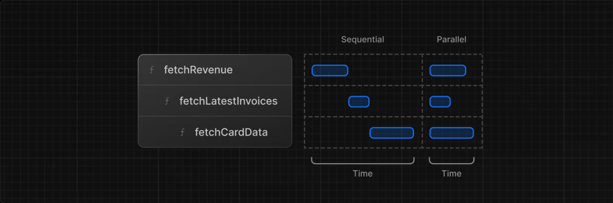
  - For example, we need to wait for fetchRevenue() to execute before fetchLatestInvoices() can start running, and so on.
  - 
```typescript jsx
const revenue = await fetchRevenue();
const latestInvoices = await fetchLatestInvoices(); // wait for fetchRevenue() to finish
const {
  numberOfInvoices,
  numberOfCustomers,
  totalPaidInvoices,
  totalPendingInvoices,
} = await fetchCardData(); // wait for fetchLatestInvoices() to finish
``` 
  - A common way to avoid waterfalls is to initiate all data requests at the same time - in parallel.
  - Instead of waiting for each request to finish before starting the next one, you can start all requests simultaneously and then wait for all of them to complete.
    - ```typescript jsx
      const data = await Promise.all([
      invoiceCountPromise,
      customerCountPromise,
      invoiceStatusPromise,
      ]);```
    - but there is one issue which is discussed in the next chapter. 


## chapter 8: Static and Dynamic Rendering
- Static rendering is useful for UI with no data or data that is shared across users, such as a static blog post or a product page. It might not be a good fit for a dashboard that has personalized data which is regularly updated. 
- When your data updates, you want to show the latest changes in your dashboard. Static Rendering is not a good fit for this use case.
- Dynamic rendering is useful for UI that requires personalized data or frequently updated data, such as a user dashboard or real-time data feeds.
- Dynamic rendering allows you to fetch the latest data on each request, ensuring that users always see the most up-to-date information. Content is rendered on the server for each user at request time (when the user visits the page).
- With dynamic rendering, your application is only as fast as your slowest data fetch.

## chapter 9: streaming
- Streaming is a data transfer technique that allows you to break down a route into smaller "chunks" and progressively stream them from the server to the client as they become ready.
- There are two ways you implement streaming in Next.js:
  - At the page level, with the loading.tsx file (which creates <Suspense> for you).
  - At the component level, with <Suspense> for more granular control.
- One advantage of this approach is that you can significantly reduce your page's overall loading time.
- Instead of waiting for all data to be fetched and all components to be ready before sending anything to the client, you can start sending parts of the page as soon as they are ready.
- This means that users can start seeing and interacting with parts of the page sooner, improving the perceived performance of your application.
- Refer to [loading.tsx](app/dashboard/(overview)/loading.tsx) file for implementation of streaming at page level.
  - loading.tsx is a special Next.js file built on top of React Suspense. It allows you to create fallback UI to show as a replacement while page content loads.
  - Since <SideNav> is static, it's shown immediately. The user can interact with <SideNav> while the dynamic content is loading.
  - The user doesn't have to wait for the page to finish loading before navigating away (this is called interruptable navigation).
  - refer to [skeletons.tsx](app/ui/skeletons.tsx) to understand how we use loading effects along with loading.tsx. 
- Right now, your loading skeleton will apply to the invoices. Since loading.tsx is a level higher than /invoices/page.tsx and /customers/page.tsx in the file system, it's also applied to those pages. We can change this with Route Groups. Create a new folder called /(overview) inside the dashboard folder. Then, move your loading.tsx and page.tsx files inside the folder:
- app -> dashboard -> (overview) -> loading.tsx. Here we have created a route group called overview. Route groups allow you to organize your routes without affecting the URL structure of your application.
- 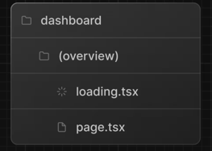, now loading.tsx will only apply to the overview pages. 
- So far, you're streaming a whole page. But you can also be more granular and stream specific components using React Suspense.
  - Suspense allows you to defer rendering parts of your application until some condition is met (e.g. data is loaded).
  - wrap your dynamic components in Suspense. Then, pass it a fallback component to show while the dynamic component loads.
  - slow data request from fetchRevenue() [data.ts](app/lib/data.ts) is the request that is slowing down the whole page. Instead of blocking your whole page, you can use Suspense to stream only this component and immediately show the rest of the page's UI.
  - 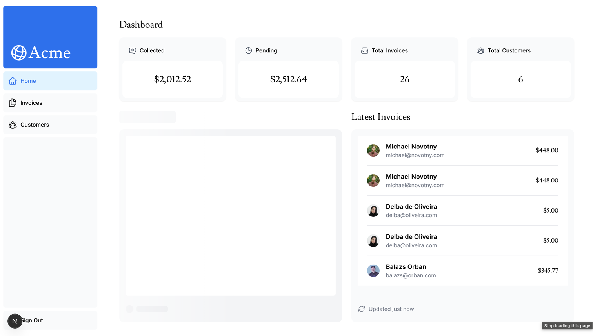, we can achieve this by moving data fetching to the component itself, and whenever we use the component in a page, wrap it in Suspense with a fallback. refer: [page.tsx](app/dashboard/(overview)/page.tsx). With this setup, only the RevenueSummary component will be delayed, while the rest of the page loads immediately.
- By moving data fetching down to the components that need it, you can create more granular Suspense boundaries. This allows you to stream specific components and prevent the UI from blocking.

## chapter 10: Adding Search and Pagination
- Search and pagination are common features in web applications that deal with large datasets. They help users find specific information quickly and navigate through large lists of items efficiently.
- There are a couple of benefits of implementing search with URL params:
  - Bookmarkable and shareable URLs: Storing search and filter state in the URL allows users to bookmark or share a link that restores the exact same results, filters, and pagination.
  - Server-side rendering: URL params are visible to the server before rendering, allowing the backend to fetch filtered/paginated data and return a fully-rendered page without client-side loading.
  - Analytics and tracking: Analytics tools automatically record full URLs, so storing search parameters in the URL makes user behavior (queries, filters, pages) trackable without extra client-side code.
- Adding the search functionality:
  - useSearchParams- Allows you to access the parameters of the current URL. This is useful for reading query parameters, such as search terms or filters, from the URL.
    - for example: `/dashboard/invoices?page=1&query=pending` would look like this: `{page: '1', query: 'pending'}`
    - useSearchParams() gives you the current URL query parameters. 
      - `/dashboard/products?page=2&query=apple `
      - `useSearchParams()` returns an object similar to: { page: "2", query: "apple" }
  - usePathname - Lets you read the current URL's pathname. For example, for the route /dashboard/invoices, usePathname would return '/dashboard/invoices'.
  - useRouter - Enables navigation between routes within client components
- refer [search.tsx](app/ui/search.tsx) for implementation of search functionality.
  - 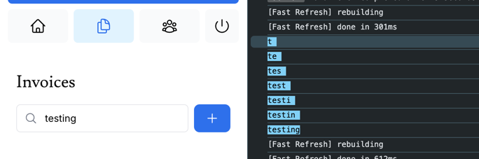
- Why create new URLSearchParams(searchParams)?
  - Because the object returned by useSearchParams() is read-only. You cannot .set() or .delete() on it.
  - To modify the search parameters, you need to create a new instance of URLSearchParams, which is mutable. This allows you to add, update, or remove query parameters as needed before constructing the new URL for navigation.
- Now that you have the query string. You can use Next.js's useRouter and usePathname hooks to update the URL. 
  - replace(`${pathname}?${params.toString()}`);
  - ${pathname} is the current path, in your case, "/dashboard/invoices"
  - As the user types into the search bar, params.toString() translates this input into a URL-friendly format.
  - replace(${pathname}?${params.toString()}) updates the URL with the user's search data. For example, /dashboard/invoices?query=lee if the user searches for "Lee".
  - The URL is updated without reloading the page, thanks to Next.js's client-side navigation
- Keeping the url and input in sync:
  - This line: `defaultValue={searchParams.get('query')?.toString()}` means When the page loads, set the input box’s initial value based on the URL’s ?query= parameter.
  - if someone opens: `/dashboard/products?query=apple`, the input box will show "apple" right away.
- before typing in the search box: 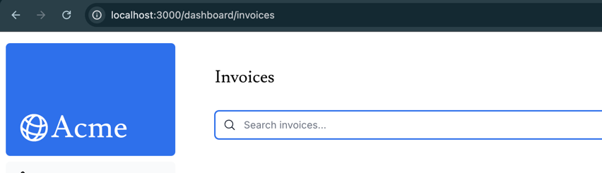
- after typing in the search box: 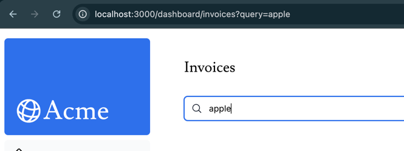
- Updating the table: 
  - when something returns promise, we need to use await to get the actual data out of the promise.
  - refer [page.tsx](app/dashboard/invoices/page.tsx) inside invoices folder for implementation of updating the table based on search input.
- What is debouncing?
  - Debouncing is a programming practice that limits the rate at which a function can fire. In our case, you only want to query the database when the user has stopped typing.
  - Without debouncing, every keystroke would trigger a new database query, which can be inefficient and lead to performance issues.
    - Trigger Event: When an event that should be debounced (like a keystroke in the search box) occurs, a timer starts.
      Wait: If a new event occurs before the timer expires, the timer is reset.
      Execution: If the timer reaches the end of its countdown, the debounced function is executed.
  - refer [search.tsx](app/ui/search.tsx), to see how we used debounce. 
  - By debouncing, you can reduce the number of requests sent to your database, thus saving resources.
- Pagination:
  - refer [pagination.tsx](app/ui/invoices/pagination.tsx)
    - createPageURL creates an instance of the current search parameters.
    - Then, it updates the "page" parameter to the provided page number.
    - Finally, it constructs the full URL using the pathname and updated search parameters.

## chapter 11: Mutating Data

- Server Actions:
  - Before Server Actions, how did we mutate data? 
    - You had to make API routes (POST /api/update-user) 
    - Then from your component you call fetch('/api/...')
    - Then the API route talks to DB 
    - Then it returns a response 
    - Then you update the UI
  - Server Actions remove the need for API routes.
    - You write a normal async function in your code, mark it as use server, and Next.js runs it only on the server.
- A Server Action is a function that you write in your code, marked with "use server", that runs on the server when the client calls it.
```typescript jsx
"use server";

export async function createInvoice(formData) {
  // This code runs on the server, NOT in the browser
  await db.insert(...)
}
```
```typescript jsx
<form action={createInvoice}>
  ...
</form>
```
- No API routes needed, no fetch calls from the client. Just call the function directly from your component.
- Also server actions are secure by default. Since they run on the server, your database credentials and logic stay hidden from the client.
  - Next.js automatically handles the security of Server Actions. 
- Why are Server Actions useful in Next.js?
  - Because Next.js already separates components into: Server and Client Components.
  - Server Actions let these two sides talk directly, without API routes.
    - It’s like giving Server Components and Client Components a “phone line” to talk to the server.
  - Server Actions allow Server Components to mutate data without needing API routes.
- How are the referenced functions safe to use in the browser?
  - Because Next.js only includes the function code in the browser if it’s used in a Client Component.
  - If a Server Action is only used in Server Components, its code never gets sent to the browser.
  - You do not send the actual function to the browser. Instead Next.js generates a secure reference (like a token) that the browser can use to call the function on the server.
- Using forms with server actions:
  - In Next.js, when you use a form with a Server Action, the form data is automatically serialized and sent to the server when the form is submitted.
  - You don't need to manually handle the serialization or make a fetch request. Next.js takes care of this for you.
  - When the user submits the form, Next.js captures the form data, serializes it, and sends it to the server where the Server Action function is executed with the form data as its argument.
  - An advantage of invoking a Server Action within a Server Component is progressive enhancement
  - Progressive enhancement means that your application can still function even if JavaScript is disabled in the user's browser.
  - Since the form submission is handled by the server, users can submit the form and have their data processed even if they don't have JavaScript enabled.
  - refer [actions.ts](app/lib/actions.ts), and [create-form.tsx](app/ui/invoices/create-form.tsx)
  - 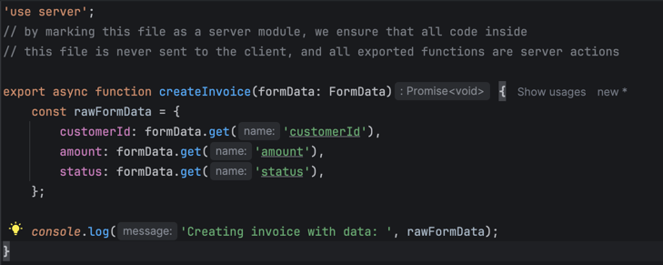
  - 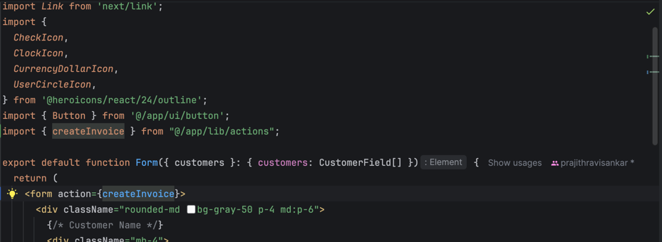
  - 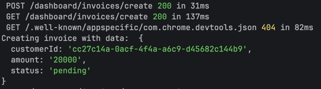
  - the output won't be visible in the browser console. You have to check the terminal where your Next.js server is running to see the console.log output from the server action.
- Validating and preparing the data: 
  - we are using a library called Zod for data validation and parsing.
  - Zod allows you to define schemas for your data, which specify the expected structure and types of the data.
  - refer [actions.ts](app/lib/actions.ts)
- Updating an invoice: 
  - Next.js allows you to create Dynamic Route Segments when you don't know the exact segment name and want to create routes based on data.
  - This could be blog post titles, product pages, etc. 
  - You can create dynamic route segments by wrapping a folder's name in square brackets. For example, [id], [post] or [slug].
  - from: 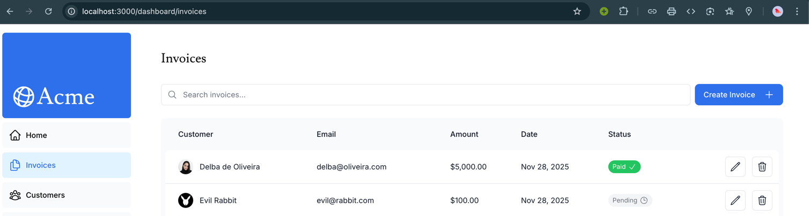
  - to: 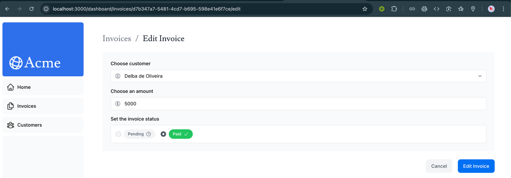
  - notice how it is pre-populated with existing invoice data. Refer [page.tsx](app/dashboard/invoices/[id]/edit/page.tsx) and all the components used inside it.
  - 